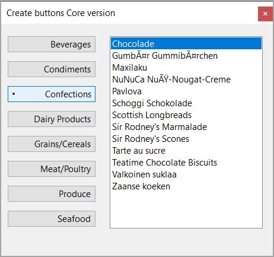

# Create dynamic buttons from SQL-Server database



Although MAUI and WPF dominate desktop development there are still new developers still starting out with Windows Forms applications and intermediate level are still using Windows Forms.

A common task is to create dynamic buttons. For the novice developer they want to create a series of buttons which is a struggle just to create buttons let alone how to handle a button’s click event.

This code sample will show how to read a list of categories for products out of a modified NorthWind database, each category will have a button, click a button to list products in a ListBox for the selected category. Click an item in the ListBox to get details on the selected product.

:beginner: All code is <kbd>.NET Framework Core</kbd> see the project `CreateDynamicControls` for the .NET Framework 4.8 version

:beginner: Before running the project, run the script in the DataScripts folder.

To store information classes are used rather than the go-to DataTable which is overkill.

For categories

```csharp
public class Category
{
    public int Id { get; set; }
    public string Name { get; set; }
    public override string ToString() => Name;
}
```

For products

```csharp
public class Product
{
    public int Id { get; set; }
    public string Name { get; set; }
    public override string ToString() => Name;
}
```

Rather than use a standard button, the following custom button is used which have a property to store the category key and another property to store the category name which in turn is used for the Text property of a dynamically created Button.

```csharp
public class DataButton : Button
{
    [Category("Behavior"), Description("Identifier")]
    public int Identifier { get; set; }
    [Category("Behavior"), Description("Stash")]
    public string Stash { get; set; }
}
```

# Data operations

All data operations are done in `DataOperations` class.

- **ReadCategories** returns a list of categories which in turn form the base to create buttons in `Operations.BuildButtons`
- **ReadProducts** is used to return all products for a category by passing a category identifier to this method.
    - The caller, in the form uses a `List<Product>` set to a `BindingList<Product>` which is used in OnDoubleClick of the ListBox to show some product details.

# Button operations

All button operations are done in `Operations` class.

## Properties

- `List<DataButton>` ButtonsList is the container for all buttons
- `Top` Initial top location of buttons which is incremented for each button created
- `Left` property for each Button
- `Width` of each Button
- `HeightPadding` pading between each Button
- `BaseName` base name for each button which has an int appended to the Button name
- `EventHandler` Action to perform on Button Click
- `ParentControl` container or form where the buttons are created and owned by

## Methods

The following method is used to instantiate properties listed above to be used the method `CreateCategoryButton`.

```csharp
public static void Initialize(Control pControl, int pTop, int pBaseHeightPadding, int pLeft, int pWidth, EventHandler pButtonClick)
{

    ParentControl = pControl;
    Top = pTop;
    HeightPadding = pBaseHeightPadding;
    Left = pLeft;
    Width = pWidth;
    EventHandler = pButtonClick;
    ButtonsList = new List<DataButton>();

}
```

This method is the core method to create buttons which recieves a category name and a category primary key and called by BuildButtons shown below.

```csharp
private static void CreateCategoryButton(string text, int categoryIdentifier)
{

    var button = new DataButton()
    {
        Name = $"{BaseName}{_index}",
        Text = text,
        Width = Width,
        Location = new Point(Left, Top),
        Parent = ParentControl,
        Identifier = categoryIdentifier,
        Visible = true,
        ImageAlign = ContentAlignment.MiddleLeft,
        TextAlign = ContentAlignment.MiddleRight
    };

    button.Click += EventHandler;
    ButtonsList.Add(button);

    ParentControl.Controls.Add(button);
    Top += HeightPadding;
    _index += 1;

}
```

The following method reads all categories from a SQL-Server database table then in a foreach creates a button

```csharp
public static void BuildButtons()
{
    foreach (var category in DataOperations.ReadCategories())
    {
        CreateCategoryButton(category.Name, category.Id);
    }
}
```

# Form code

The following components are used to work with products. Novice developers usually don't understand [BindingList](https://learn.microsoft.com/en-us/dotnet/api/system.componentmodel.bindinglist-1?view=net-7.0) and [BindingSource](https://learn.microsoft.com/en-us/dotnet/api/system.windows.forms.bindingsource?view=windowsdesktop-6.0) and instead work with form controls. Anytime we can get away with not touching controls is best as done with a BindingSource and BindingList.

```csharp
private BindingList<Product> _productsBindingList;
private readonly BindingSource _productBindingSource = new BindingSource();
```

## Load event

- Set base name for button
- Initialize properties used in Operations class to build buttons along with an event/action
- Build the Buttons for categories

```csharp
Operations.BaseName = "CategoryButton";
            
Operations.Initialize(this,20,30, 10,100, CategoryButtonClick);
            
ProductsListBox.DoubleClick += ProductsListBoxOnDoubleClick;
Operations.BuildButtons();
```

## Code to read products

- First set each Button's image to null as when clicking a button an image is assigned to know which category is being viewed
- Cast the current Button to our custom Button type <kbd>DataButton</kbd>
- Get products for the current category

```csharp
private void CategoryButtonClick(object sender, EventArgs e)
{
    Operations.ButtonsList.ForEach(b => b.Image = null);

    var button = (DataButton)sender;

    button.Image = Resources.CheckDot_6x_16x;
            
    _productsBindingList = new BindingList<Product>(DataOperations.ReadProducts(button.Identifier));
    _productBindingSource.DataSource = _productsBindingList;
    ProductsListBox.DataSource = _productBindingSource;

}
```

## Read products

The following code is for the ListBox on double click event to show some details for the current product.

```csharp
private void ProductsListBoxOnDoubleClick(object sender, EventArgs e)
{
    if (_productBindingSource.Current is null)
    {
        return;
    }

    var product = (Product) _productBindingSource.Current;

    MessageBox.Show($"{product.Id}, {product.Name}");
}
```

# Summary

By following the code presented it is easy to create dynamic buttons.

So what happens if there are more buttons than form real estate? Add a [FlowLayoutPanel Control](https://learn.microsoft.com/en-us/dotnet/desktop/winforms/controls/flowlayoutpanel-control-overview?view=netframeworkdesktop-4.8) to the form and rather than creating buttons on the form, created them on the FlowLayoutPanel Control and set AutoScroll property to true.

Note that what has been shown with a ListBox can be done with other controls e.g. DataGridView, ListView etc.


