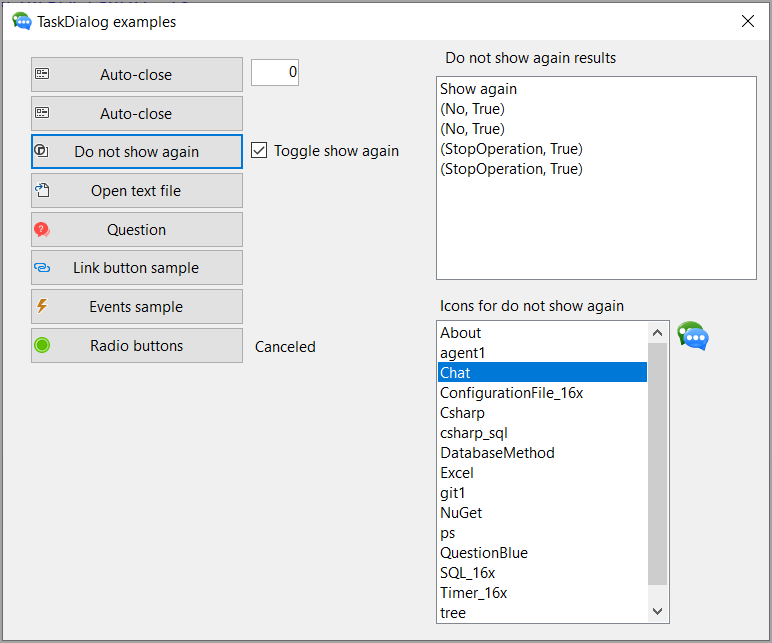
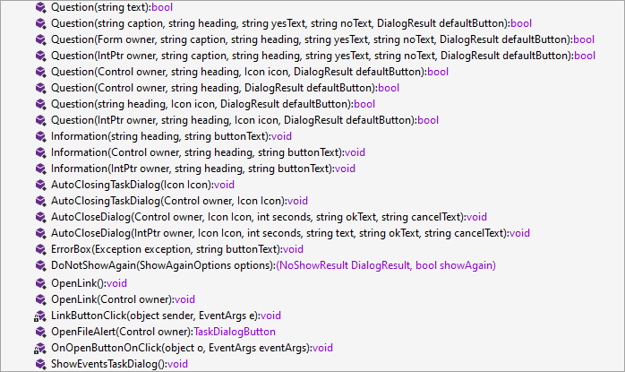

# About

This project shows how to use TaskDialog in a Windows Forms Core application where the main difference between this project and the WPF project is that for Windows Forms TaskDialog accepts a control or form while for WPF we need to pass in a IntPtr.

> **Note**
> At this time all code works, taken from a Microsoft TechNet article I wrote back with .NET Core 5, this version is for .NET Core 7. Will be rewriting the article shortly for DEV site.

